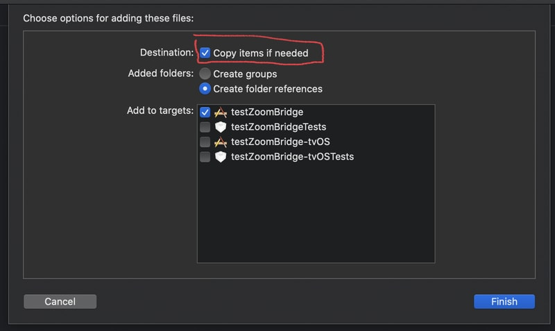
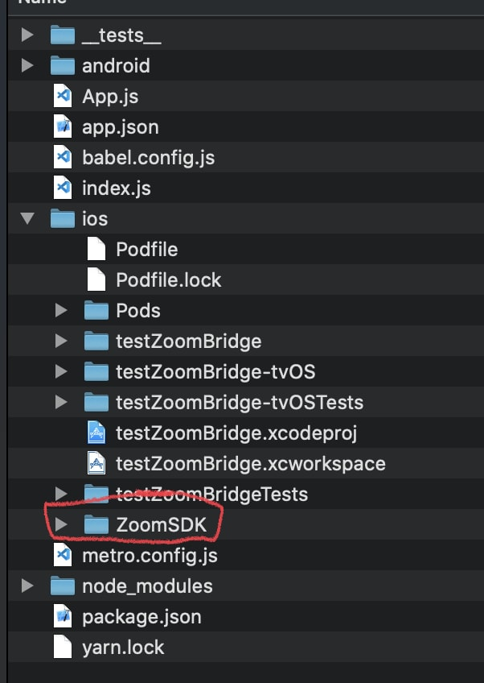
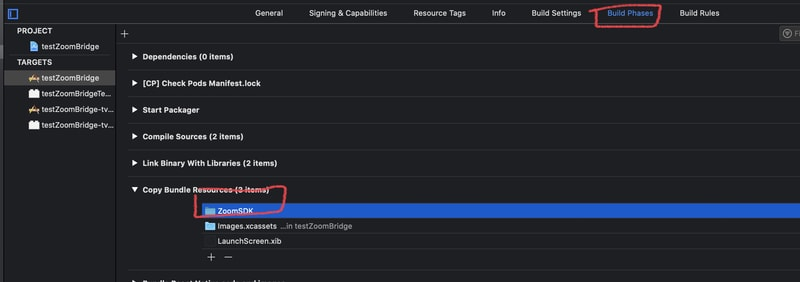
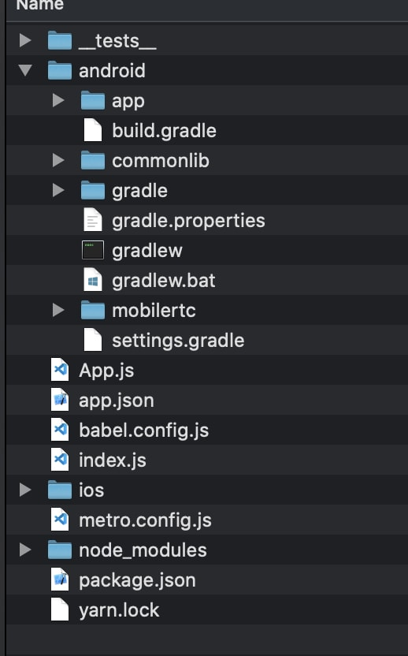
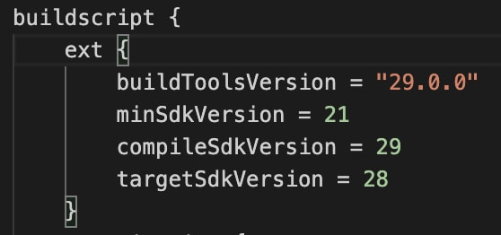
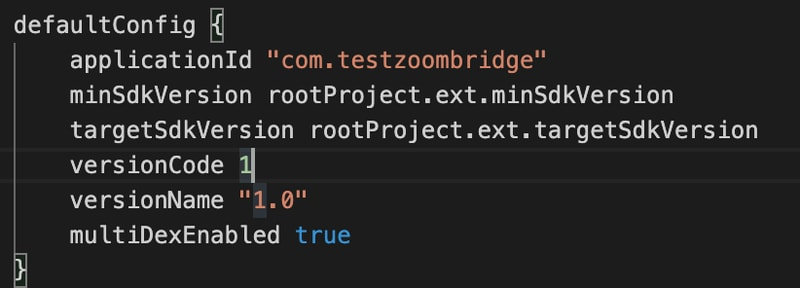

# react-native-zoom-us-bridge
This library bridges React Native with zoom.us SDK and implements the SDK authentication process.

***Note:  User login using zoom user accounts is not implemented.***

## Table of Contents

* [Installation](#installation)
  * [iOS](#ios-installation)
  * [Android](#android-installation)
* [Zoom Account Setup](#zoom-account-setup)
* [Usage](#usage)
* [Errors](#errors)
* [Running the Example app](#example-project)


## Installation

Install the library from npm:

```sh
npm i @mokriya/react-native-zoom-us-bridge --save
```

or 

```sh
yarn add @mokriya/react-native-zoom-us-bridge
```

Then follow the instructions for your platform to link into your project:

### iOS installation

<details>
  <summary>Using CocoaPods</summary>

Due to the size of the sdk you will need to enable [git lfs](https://help.github.com/en/github/managing-large-files/installing-git-large-file-storage)

```sh
brew install git-lfs
git lfs install
```

Setup your Podfile by adding this line inside of your app target (found at ios/Podfile).

```ruby
pod 'ZoomSDK', :git => 'https://github.com/mokriya-org/zoom-us-ios-sdk-dev-pod.git'
```

***Note***: This particular pod cannot be used for release build. You must use the production Pod instead. However, this pod file does not work with simulators.

Then run in the ios folder

```sh
pod install
```

### Production Zoom.us SDK

```ruby
`pod 'ZoomSDK', :git => 'https://github.com/mokriya-org/zoom-us-ios-sdk-pod.git'`
```
</details>

<details>
  <summary>Manual Link</summary>
  
[Download zoom.us iOS SDK](https://github.com/zoom/zoom-sdk-ios)

1. Unzip the sdk and locate contents.
2. Drag lib folder into the iOS Project
    
3. Make sure to check `copy if needed`
    
4. Rename folder to `ZoomSDK` double check by looking up the folder in finder or terminal.
    
    
5. On Xcode Open ZoomSDK folder, find MobileRTC.framework, drag it to General -> Frameworks, Libraries... make sure its set to `Embed & Sign` (ios_image5)
    
6. Verify the `ZoomSDK` folder is in `Build Phases`, `Copy Bundle Resources`, if not, drag the folder in there.
    

See [here](https://marketplace.zoom.us/docs/sdk/native-sdks/iOS/getting-started/integration) for more information.
</details>

### App store submission (iOS)

The app's `Info.plist` file must contain a `NSCameraUsageDescription` and `NSMicrophoneUsageDescription` with a description explaining clearly why your app needs access to the camera and microphone, otherwise Apple will reject your app submission.


### Android installation

***There are no semi-auto way to install the Android SDK at the moment. It must be done 100% manually.***

<details>
  <summary>Manual Link</summary>
  
[Download zoom.us Android SDK at](https://github.com/zoom/zoom-sdk-android)


1. Unzip the sdk and locate `commonlib` and `mobilertc`.
2. Drag both folders into your android project (Project/android)
    
    
3. Open `android/settings.gradle`
4. Add the following string `, ':mobilertc', ':commonlib'` into the `include ':app'`
    
5. Open `android/build.gradle`
6. Update your SDK versions to match the following

    ```groovy
        buildToolsVersion = "29.0.0"
        minSdkVersion = 21
        compileSdkVersion = 29
        targetSdkVersion = 28
    ```
   
   

8. Open `android/app/build.gradle`
9. Add `multiDexEnabled true` into `defaultConfig`
    


See [here](https://marketplace.zoom.us/docs/sdk/native-sdks/android/getting-started/integration) for more information.
</details>

## Zoom Account Setup

1. [Signup for an account](https://zoom.us/signup)
2. Verify your email
3. [Signin to the developer console](https://marketplace.zoom.us)
4. Agree to terms of becoming a developer
5. [Create a new SDK App](https://marketplace.zoom.us/docs/sdk/native-sdks/preface/sdk-app)
6. [Create a new JWT App (optional for hosting meetings)](https://marketplace.zoom.us/docs/guides/authorization/jwt-app)

## Usage

### Basic joining meeting
APP key and secrent is required
```javascript
import RNZoomUsBridge from 'react-native-zoom-us-bridge';

RNZoomUsBridge.initialize(
  ZOOM_APP_KEY,
  ZOOM_APP_SECRET,
);

RNZoomUsBridge.joinMeeting(
  meetingId,
  userName,
  meetingPassword,
);


RNZoomUsBridge.startMeeting(

);
```
### Hosting meeting
JWT key and secret is required

```javascript

// get accessToken to communicate with zoom api

// use token to get userId of the user account you are creating the meeting with

// use the userId to obtain the Zoom Access Token

// use Zoom Access Token etc, to create a meeting

// use the meeting Id to start & join the meting
RNZoomUsBridge.startMeeting(
  meetingId,
  'userName',
  userId,
  userZoomAccessToken
);
```

### Events from zoom sdk
Use event emitter to listen for meeting state changes
```javascript
import RNZoomUsBridge, {RNZoomUsBridgeEventEmitter} from 'react-native-zoom-us-bridge';

const meetingEventEmitter = new NativeEventEmitter(RNZoomUsBridgeEventEmitter);

meetingEventEmitter.addListener(
  'SDKInitialized',
  () => {
    console.log("SDKInitialized");
  }
);

"SDKInitialized", "meetingStarted", "meetingJoined", "meetingSetToHidden", "meetingEnded", "meetingStatusChanged", "waitingRoomActive", "meetingError"

```
| Listener             | Description                                  |
|----------------------|----------------------------------------------|
| SDKInitialized       | Status update - SDK initialized successfully |
| meetingStarted       | Status update - Meeting started successfully |
| meetingJoined        | Status update - Meeting joined successfully  |
| meetingEnded         | Status update - Meeting ended without error  |
| meetingStatusChanged | Status update - Updates the meeting status   |
| meetingError         | Error - Meeting ended with error             |
| waitingRoomActive    | Error - Meeting waiting room is active       |


## Errors
build failed undefined issue, file size small, missing lfs

build failed, wont run on sim, need dev libs

build success, apple reject, wrong libs, need prod libs

## Example Project

[Follow Example Setup Here](RNZoomUSBridgeExample/README.md)

| Android                                                                                                                   | iOS                                                                                                                       |
| --------------------------------------------------------------------------------------------------------------------- | ----------------------------------------------------------------------------------------------------------------------------- |
|  |  |

